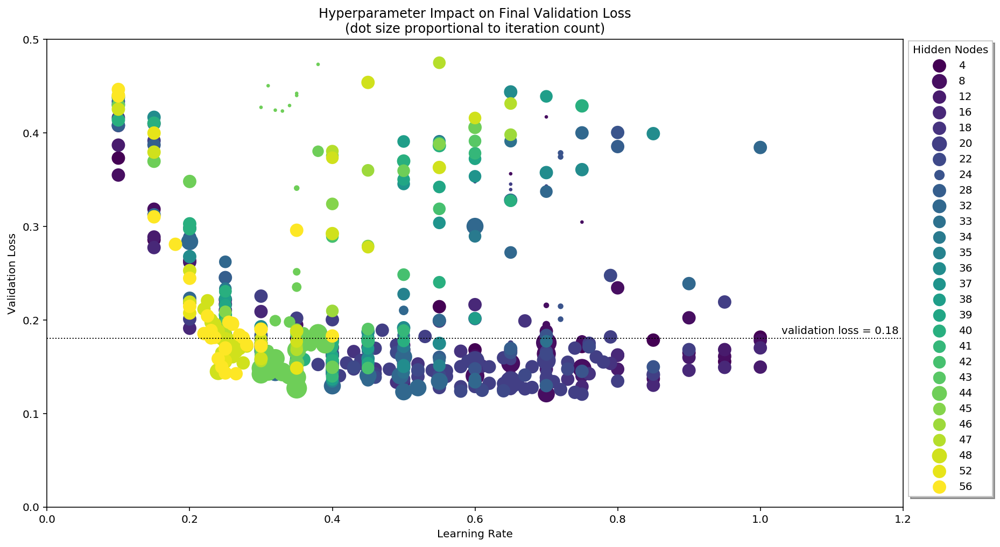

## Introduction

This is an extended solution of the first project in Udacity Deep Learning Nanodegree: **Predicting Bike-Sharing Data**.

In addition to completing the requirements of the project, it also contains extra tools for automating network training, collecting logs from the training session and presenting the accumulated data. Finally, the project’s notebook includes a summary of the findings from analysing the training logs.

## The Problem and The Solution
The final objective of the project was to find a set of hyperparameters that, when used to train the implemented neural network, result in good prediction accuracy for the network.

Trying to find the best training parameters by simply setting them by hand and seeing what happens can work. However, it also introduces the unwelcome factor of luck and most likely won’t result in optimal values. That’s why I decided to go a bit deeper into this problem. I wanted to create a data set representing the relationships between the hyperparameters and the network’s performance during training.

To accomplish that, I wrote two extra classes for the project: HyperparameterGenerator and LogParser. The former is used to generate a range of hyperparam values, while the latter reads a text file containing training logs and converts it into a Pandas DataFrame.

Armed with these tools I modified the project’s Jupyter notebook to implement looped network training. The loop automatically starts a new training session for each of the parameter sets provided by HyperparameterGenerator. Results of each session, including the final validation loss are recorded in a log file.

Then, after almost 700 training sessions I begun analysing the collected data. I made further modifications to the notebook to display various plots visualizing the data. The results can be found in the **Your_first_neural_network.ipynb** Jupyter notebook (I left its original name).

## Files
Some files come from the course sources and were created by Udacity staff. Some were modified as required by the project. Other were created to facilitate collection of training data.

- **Your_first_neural_network.ipynb** -- a Jupyter notebook containing guidelines for the project as well as code for preparing the data set, training the neural network and testing it. That code comes already implemented by Udacity staff. Additional custom code was added to implement automatic training with generated parameters and to create visualizations of collected data. Finally, conclusions from the data analysis were written down also in the notebook.
- **my_answers.py** -- Python script that defines the NeuralNetwork class, which is used in the project's notebook. Implementing this class is the main goal of the project. Some method declarations and comments are provided as a starting point.
- **hyperparam_generator** -- Python script implementing a class for automatic generation of training parameters.
- **log_parser** -- defines a class used to read collected training logs.
- **Bike-Sharing-Dataset/** -- directory containing the project's data set. See inside for its own README.
