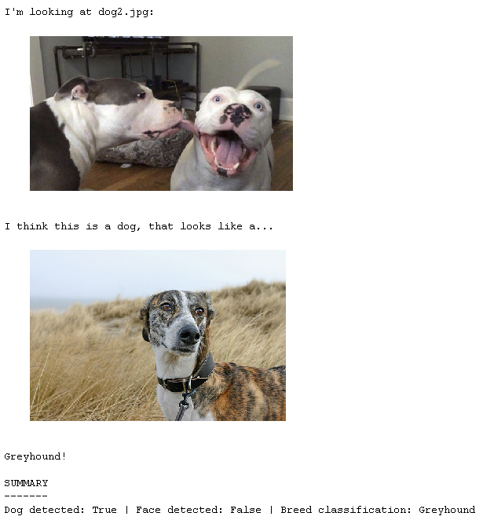

This project is focused on implementing CNNs for human face detection and dog breed classification. Several techniques are explored, including computer vision algorithms from OpenCV, designing custom networks from scratch and employing transfer learning with pre-trained models.
